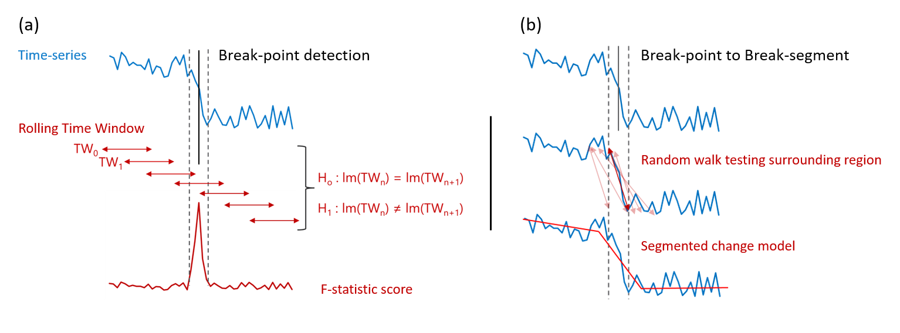

# Summary

AQEval (Air Quality Evaluation) is an R package of functions for the routine investigation 
of discrete changes in air quality time-series, e.g. assessing the impact of interventions 
and/or pollution events. The main functions use break-point/segmentation (BP/S) methods to 
detect, characterise and quantify change, while other functions build on these to provide 
a workflow for those looking to measure smaller changes and/or changes in more complex 
environments. 

# Statement of Need

Authorities responsible for air quality management are typically required to implement and 
evaluate the air quality interventions they adopt [@bradley2019review]. These interventions 
are often costly, disruptive and unpopular [@glazener2019transforming], and associated 
benefits are often hard to measure because of the inherent variability of air quality data 
[@kelly2011impact; @pearce2011quantifying; @jones2012large; @grange2019using]. Various 
methods have been developed to investigate discrete changes in a wide range of time-series 
[see e.g. @reeves2007review; @truong2020selective], and several R [@r2025r] packages have 
been developed for their use, e.g. bcp [@erdman2008bcp], changepoint [@killick2016changepoint], 
segmented [@muggeo2008segmented], and strucchange [@zeileis2002strucchange]. Some have even 
been applied to the detection of large changes in air quality time-series [@carslaw2006change], 
and with additional signal isolation to smaller changes [@carslaw2007detecting]. However, 
those tasked with air quality data analysis, although highly skilled in a wide range of air 
quality monitoring and assessment activities, are unlike to be able to dedicate sufficient 
time and funding to the development of in-house expertise required to routinely apply these. 

AQEval was developed to address this skill gap. It aligns the inputs and outputs of a number 
of statistical methods to provide a one-package option for anyone interested in using R to 
routinely detect, characterise and quantify discrete change in air quality data. 

As many 
air quality professionals already use the R package openair [@carslaw2012openair; @ropkins2012openair] 
for more conventional analysis and data visualisation, AQEval has also been written using 
openair coding conventions and function structure to reduce the learning-curve typical 
associated with learning new software. 

# Sources

AQEval is freely available under General Public License (GPL) from conventional on-line R archives: 

-	The latest (stable) release version of AQEval is on the Comprehensive R Archive Network (CRAN) at 
[https://CRAN.R-project.org/package=AQEval](https://CRAN.R-project.org/package=AQEval); and, 
-	The developers’ version and code are publicly available on GitHub at 
[https://github.com/karlropkins/AQEval](https://github.com/karlropkins/AQEval), which can also be 
used to report issues or suggest changes. 
-	The project website is at [https://karlropkins.github.io/AQEval/](https://karlropkins.github.io/AQEval/).

# Analytical Rationale

The AQEval Break-Point/Segment (BP/S) methods involve three steps: finding possible ‘points of change’, 
using break-points, and then characterising and quantifying ‘regions of change’ about these as segments:  

1. Breaks-points are found using the strucchange methods of Zeileis and colleagues 
   [@zeileis2002strucchange; @zeileis2003testing]. Here, a rolling-window approach is applied: 
   a first subset of data (or time-series window, TW~0~ in \ref{fig:1} Figure 1a), is selected and a linear 
   regression model built; the window is then rolled on, typically one measurement (TW~1~ in 
   Figure 1a) and a second model build; and so on, until the end of the time-series; then, 
   points of likely change are identified using the F-Stat measure of difference for sequential 
   models. 
2. In addition to the standard Bayesian Information Criterion (BIC) testing used by strucchange, 
   AQEval also checks that all terms associated which each break-point are statistically valid 
   (p<0.05), discarding any combinations generating invalid models. This approach was selected 
   on the basis of simulation testing.
3. Finally, the segmented methods of Muggeo and colleagues [@muggeo2003estimating; @muggeo2008segmented; 
   @muggeo2017interval] are used to extend the break-point to break-segments. Here, the confidence 
   intervals for the selected break-points are used as the start points when building the segmented 
   model, and final segment ranges are assigned based on random walk testing the regions about these 
   points as illustrated in Figure 1b.    

\label{fig:1} 

Figure 2 \ref{fig:2} shows the break-point/segment analysis of an NO~2~ time-series from a heavily trafficked 
site in central London where a change event (ca. 25 µg.m-3; 31%) is detected between 2003-01-11 and 
2003-02-19, and detected using standard break-point/segment analysis. 

\label{fig:2} 

In some cases changes are small or local air inputs are complex, and time-series may require additional 
pre-processing to successfully isolate an obscured change-event. For example, if a studied time-series 
is several years long, a small change may be hidden by seasonally variability in meteorological 
contributions. AQEval includes Generalized Additive Model (GAM) based methods 
(based on mgcv; Wood 2017, Wood 2021) to build and subtract such variance. By default, these take the 
form: 

[pollutant] = s1(day-of-year) + s2(hour-of-day) + te1(wind speed, wind direction)

[pollutant]isolated = ([pollutant] - [pollutant]predicted) + mean(pollutant)

Where the investigate pollutant concentration, [pollutant], is modelled as a function of 
day-of year, hour-of-day and wind speed and direction using a combination spline (s1 and s2) and 
tensor (te1) fit-terms, and the unmodelled component is estimated as the mean-centred residual 
of this model.
  
This default correction can also be modified to include other potential confounders, e.g. other 
frequency terms (e.g. day-of-week and/or week-of-year), background contributions (by subtraction 
of local variance associated with trends at near-by site not affected by the investigated change), 
or proxies for other local contributors (e.g. other meteorological parameters like air temperature, 
markers for other sources, etc). Figure 3a shows the break-point analysis of NO2 from a nearby but 
less heavily trafficked site where seasonality dominates the time-series, and Figure 3b shows the 
smaller (ca. 6.6; 13%) underlying change-event observed at a similar time to the large change 
observed at the more heavily trafficked site in Figure 2 (2002-09-09 to 2002-12-21 compared with 
2003-01-11 and 2003-02-19).  

[insert figure 3 a and b about here]

# Related Outputs 

Detailed descriptions of the AQEval functions, and an extended discussion and analysis of the examples used in Figures 2 and 3 is provided in the package introduction https://karlropkins.github.io/AQEval/articles/AQEval_Intro_Preprint.pdf.  
Other work using AQEval include:
•	Ropkins & Tate (2021; https://doi.org/10.1016/j.scitotenv.2020.142374), a peer-reviewed article reporting on a multi-species AQEval analysis of the air quality impact of the COVID-19 lockdown in the UK. 
•	Ropkins et al (2022; https://doi.org/10.1039/D1EA00073J), a peer-reviewed article reporting on the use of AQEval to measure the impact of a bus fleet intervention on NO2 levels. 
•	Also Clear Air Zone (CAZ) impact assessment reports include analyses using AQEval, see e.g.: 
o	CAZ Baseline Study (https://www.ipsos.com/sites/default/files/ct/publication/documents/2021-02/15012_localno2plans-baselineresearchfindings.pdf)   
o	First Year Report (https://www.ipsos.com/sites/default/files/ct/news/documents/2022-05/local-no2-plans-main-report-may-2022.pdf)  
o	…
o	Report archive (https://randd.defra.gov.uk/ProjectDetails?ProjectId=20688)  

## Acknowledgements 

Initial AQEval development was funded by the UK Department for Environment, Food and Rural Affairs (Defra).  The authors gratefully acknowledge contributions and input from colleagues at University of Leeds, Defra and IPSOS Mori, and input from the Defra/Department for Transport Joint Air Quality Unit (JAQU) Technical Independent Review Panel (T-IRP) as part of internal review. The authors also gratefully acknowledge the work of the R core team and their many collaborators in developing and maintaining the open-source statistical language R and associated packages (http://www.r-project.org/).  

The views and opinions expressed herein by the authors are their own and do not necessarily reflect those of UK Government or any agency thereof.

# References
