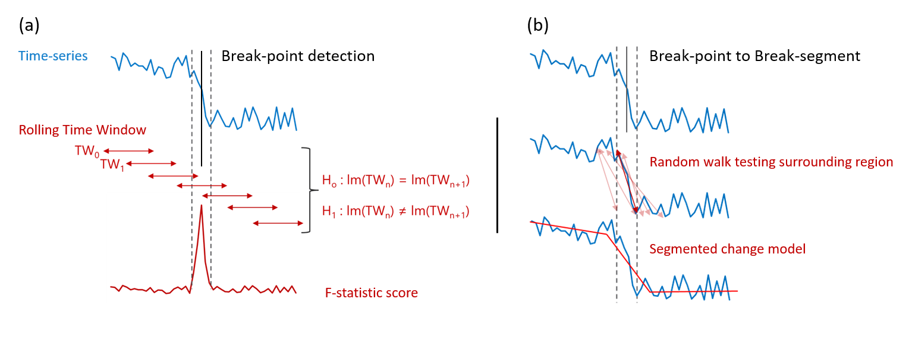
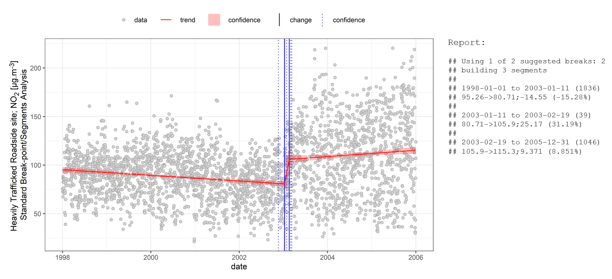

# Summary

`AQEval` (Air Quality Evaluation) is an `R` package for the routine investigation 
of discrete changes in air quality time-series. The main functions, `quantBreakPoints` 
and `quantBreakSegments`, use a three-step method to find possible ‘points-of-change’, 
test these and quantify the most likely or 'regions-of-change' about them, respectively. 
Other key functions build of these to provide a workflow to measure smaller changes 
and/or changes in more complex environments. 

# Statement of Need

Authorities responsible for air quality management are typically required to implement and 
evaluate air quality interventions they adopt [@bradley2019review]. These interventions 
are often costly, disruptive and unpopular [@glazener2019transforming], and the inherent 
variability monitoring data hinders impact assessments 
[@kelly2011impact; @pearce2011quantifying; @jones2012large; @grange2019using]. Various methods 
have been developed to investigate discrete changes in a wide range of time-series 
[see e.g. @reeves2007review; @truong2020selective] and several `R` [@r2025r] packages have 
been developed for their use, e.g. `bcp` [@erdman2008bcp], `changepoint` [@killick2016changepoint], 
`segmented` [@muggeo2008segmented], and `strucchange` [@zeileis2002strucchange]. Some have even 
been applied to air quality time-series (see e.g. @carslaw2006change, @carslaw2007detecting). 
However, many of those tasked with air quality policy assessment, although highly skilled in a 
wide range of monitoring activities, are unlike to be able to dedicate sufficient time and resources 
to the development of in-house expertise in such specialist analyses. `AQEval` was developed to 
address this skill gap. It aligns the inputs and outputs of a number of statistical methods to 
provide a one-package option for anyone interested in using `R` to routinely investigate change 
in air quality data.  

# Sources

`AQEval` is freely available under General Public License (GPL): 

-	The latest (stable) release version of `AQEval` is on the Comprehensive R Archive Network (CRAN) 
[https://CRAN.R-project.org/package=AQEval](https://CRAN.R-project.org/package=AQEval); 
-	The developers’ version and code are publicly on GitHub 
[https://github.com/karlropkins/AQEval](https://github.com/karlropkins/AQEval), where issues or change 
requests can also be posted; and 
-	The project website is at [https://karlropkins.github.io/AQEval/](https://karlropkins.github.io/AQEval/).

# Analytical Rationale

The main steps of the Break-Point/Segment (BP/S) analysis are:   

1. Breaks-points are determined using the `strucchange` methods of Zeileis and colleagues 
   [@zeileis2002strucchange; @zeileis2003testing]. Here, a rolling-window approach is applied: 
   a first subset (time-series window TW~0~ in \autoref{fig:1}a) is selected and linear 
   regression modelled; the window advanced (TW~1~ in \autoref{fig:1}a) and a second 
   model built, and so on through the time-series; then, likely points-of-change 
   assigned by comparing the F-Stat scores of sequential models. 
2. In addition to the standard Bayesian Information Criterion (BIC) testing used by `strucchange`, 
   `AQEval` also checks all individual break-points are statistically valid (p<0.05), and down-scores 
   less likely combinations. 
3. Finally, the `segmented` methods of Muggeo and colleagues [@muggeo2003estimating; @muggeo2008segmented; 
   @muggeo2017interval] are used to determine regions-of-change about break-points. Here, the confidence 
   intervals for the selected break-points are used as start points, and segments assigned 
   by random walk testing about these points as shown in \autoref{fig:1}b. 

{#fig:1} 

\autoref{fig:2} shows the break-point/segment analysis of an NO~2~ time-series from a roadside site 
where a change event (*ca.* 25 $\mu$g.m^-3^; 31%) is detected between 2003-01-11 and 2003-02-19. 

{#fig:2}  

In some cases changes are small or local air inputs are complex, and time-series may require additional 
pre-processing to successfully isolate obscured change-events. For these, `AQEval` uses Generalized 
Additive Models (GAMs) [using `mgcv` methods, @wood2017generalized; @wood2025generalized] to 
subtract associated variance, by default: 
$$[pollutant] = s_1(day~of~year) + s_2(hour~of~day) + te_1(wind~speed,wind~direction)$$
$$[pollutant]_{isolated} = ([pollutant] - [pollutant]_{predicted}) + mean(pollutant)$$

Where the investigated pollutant concentration, *[pollutant]*, is modelled as a function of 
*day of year*, *hour of day* and *wind speed* and *direction* using a combination of spline 
(*s~1~* and *s~2~*) and tensor (*te~1~*) fit-terms, and the unmodelled component, 
*[pollutant]~isolated~*, is estimated as the mean-centred residual of this model. 

\autoref{fig:3}a shows the break-point analysis of NO~2~ from a nearby but 
less heavily trafficked site where seasonality dominates the time-series, and \autoref{fig:3}b shows the 
smaller (*ca.* 6.6 $\mu$g.m^-3^; 13%) underlying change-event observed at a similar 
time to the large change observed at the more heavily trafficked site in \autoref{fig:2} using 
signal isolation and then break-point/segment analysis (2002-09-09 to 2002-12-21 compared with 
2003-01-11 and 2003-02-19).  
  
{#fig:3}

This default correction can also be modified to include other potential confounders, e.g. other 
frequency terms (e.g. day of week and/or week of year), background contributions (as 
local variance associated with trends at near-by site not affected by the investigated change), 
or proxies for other local contributors (e.g. other meteorological parameters like air temperature, 
markers for other sources, etc). 

# Data Requirements and Main Functions

As many air quality professionals already use the `R` package `openair` 
[@carslaw2012openair; @ropkins2012openair] for more conventional analysis and data visualisation, 
`AQEval` uses `openair` coding syntax and data structures. Most importantly, time-series to be 
analysed should be provide `data.frame` (or similar), also containing a paired column of 
`POSIX*` class time-stamps named `date` similar to packaged example data, `aq.data`. 

Main Functions:

```r
# to quantify Break-Points (as in Figure 3a)
quantBreakPoints(
  data,               # data source, typically an openair-friendly data.frame
  pollutant,          # name of column containing the time-series to analysed
  h,                  # rolling window size, as proportion of time-series length
  ...                 # other arguments 
)
  
# to quantify Break-Segments (as in Figure 2 and 3b)
quantBreakPoints(
  data,               # as above but fits trends to regions about break-points
  pollutant,          # (see section 3 in Analytical Rationale above)
  h,                  
  ...                 
)

# For signal isolation (as used for Figure 3b)
isolateContribution(
  data,                 
  pollutant,
  ...                 # other arguments allow user to modify the isolation method 
)                     # (see package documentation for further details)
  
# findBreakPoints and testBreakPoints can also be used to fine-tune BP/S models
```

# Related Outputs 

The `AQEval` functions are described in further detail, along with worked examples of 
the code used to generate Figures \ref{fig:2} and \ref{fig:3}, in the 
[extended package introduction](https://karlropkins.github.io/AQEval/articles/AQEval_Intro_Preprint.pdf). 
Other work using `AQEval` include:

-	[Ropkins & Tate (2021)](https://doi.org/10.1016/j.scitotenv.2020.142374), a peer-reviewed article 
  on the multi-species AQEval analysis of air quality during the UK COVID-19 lockdown. 
-	[Ropkins et al (2022)](https://doi.org/10.1039/D1EA00073J), a peer-reviewed article on 
  the use of `AQEval` to measure the NO~2~ impact of bus fleet interventions. 
-	Also Clear Air Zone (CAZ) impact assessment reports include analyses using `AQEval`, see e.g.: 
    - [CAZ Baseline Study](https://www.ipsos.com/sites/default/files/ct/publication/documents/2021-02/15012_localno2plans-baselineresearchfindings.pdf) 
    - [First Year Report](https://www.ipsos.com/sites/default/files/ct/news/documents/2022-05/local-no2-plans-main-report-may-2022.pdf) 
    -	(...) 
    - [Report archive](https://randd.defra.gov.uk/ProjectDetails?ProjectId=20688) 

# Acknowledgements 

Initial `AQEval` development was funded by the UK Department for Environment, Food and Rural Affairs 
(Defra). The authors gratefully acknowledge contributions from colleagues at University 
of Leeds, Defra and IPSOS Mori, and internal review by the Defra/Department for Transport Joint Air Quality 
Unit (JAQU) Technical Independent Review Panel (T-IRP). The authors also 
gratefully acknowledge the work of the R core team and collaborators in developing and 
maintaining the open-source statistical language R and associated packages [http://www.r-project.org/](http://www.r-project.org/).  

The views and opinions expressed herein by the authors are their own and do not necessarily reflect those 
of UK Government or any agency thereof.

# References
